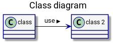
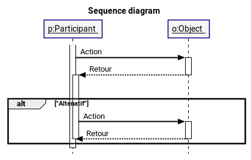
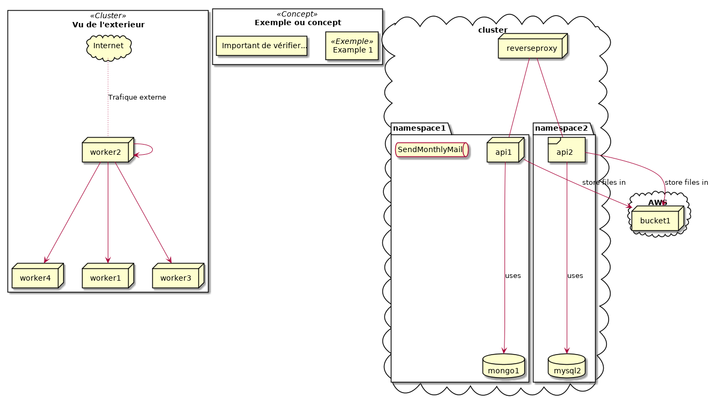

# UML Templates

Ces templates apportent quelques changements utiles au style de base de plantuml.

### Diagramme de classe

- Utilisation des symbole (privé/publique) selon la norme (+ / -)
- Theme différent

### Diagramme de séquence

- Espacement entre les différentes partie du système
- Flèches selon la norme UML.
- Theme différent

### Diagramme de déploiement

## Roadmap

- Ajouter un template basique pour chaques types de diagramme (MDD, etc)
